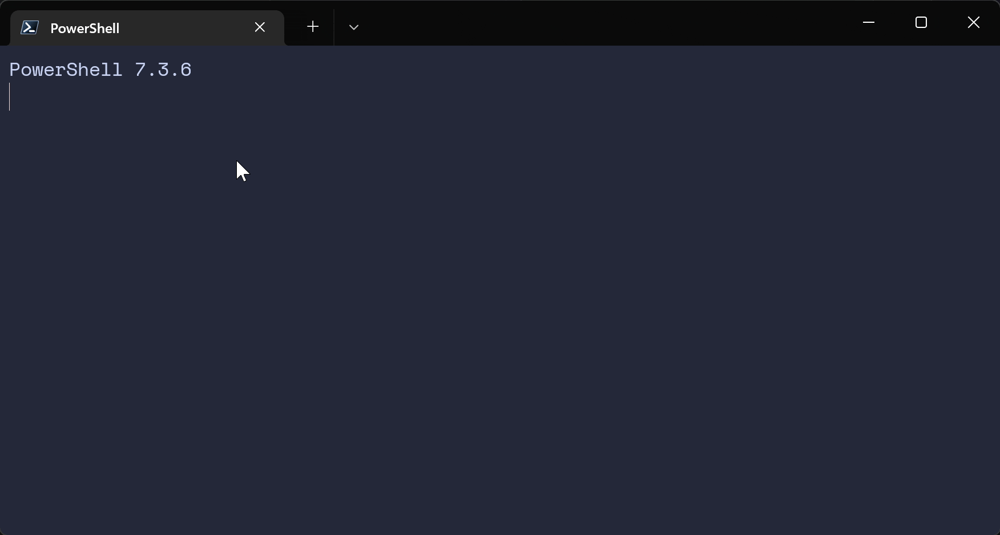

# Angela's Catppuccin for Oh My Posh

## About

This is my personalized version of the Catppuccin aesthetic for [Oh My Posh](https://github.com/JanDeDobbeleer/oh-my-posh) (OMP), tailored specifically for Python users. Using the look and palette from the official [Catppuccin theme](https://ohmyposh.dev/docs/themes#catppuccin), I customized the segments to be more succinct and compact while also providing more detail.




---

## Highlights

- Python virtual environment support (Powershell users: read the installation instructions for how to remove the original (.venv) from the terminal prompt)
- Linked paths for full directory locations and git repos.
- Git tracking icons to visualize pending file changes and more
- Status code visualization to help errors go unmissed
- Transient prompts to help keep track of command history
- Wakatime coding time for the day (add your API key as an environment variable in your terminal labelled `WAKATIME_API_KEY`)

---

## Installation

Install [Oh My Posh](https://github.com/JanDeDobbeleer/oh-my-posh) via [its instructions](https://ohmyposh.dev/docs/installation/windows).

Ensure you install a [Nerd Font](https://www.nerdfonts.com/). OMP makes this simple, so follow its instructions [here](https://ohmyposh.dev/docs/installation/fonts) if you haven't done so already.

If using Powershell, edit your profile (`code $PROFILE`) to add the following:
```
oh-my-posh init pwsh --config 'https://gitlab.com/angelajfisher/angelas-catppuccin-for-omp/-/raw/main/angelas-catppuccin.omp.json' | Invoke-Expression

$env:WAKATIME_API_KEY = "<your key>"

$env:VIRTUAL_ENV_DISABLE_PROMPT = 1
```

Or, if using Bash, edit `~/.bashrc` to include the following:
```
eval "$(oh-my-posh init bash --config https://raw.githubusercontent.com/angelajfisher/Angelas-Catppuccin-for-OMP/main/angelas-catppuccin.omp.json)"

export WAKATIME_API_KEY="<your key>"
```

Restart your terminal and then you should be go to go! Enjoy!

---

### Matching My look

If you install the theme and decide you want to dive even further into the Catppuccin aesthetic, consider setting up [their Windows Terminal themes](https://github.com/catppuccin/windows-terminal) if using Windows! The one I'm using in my screenshot is Catppuccin Macchiato. This way, your background and all of the colored text will match this OMP theme, too :)

The Nerd Font I went with for my setup is SpaceMono. I recommend installing your font via the [OMP CLI](https://ohmyposh.dev/docs/installation/fonts).

---

### Making Your Own Tweaks

I know not everyone wants a heart next to their username and others may like the segments but not the color palette. Here's some quick instructions to anyone unfamiliar with OMP themes and/or json files. Of course, you will need your own copy of the json file in order to make these changes.

To remove the heart next to the username, change line 28 to: `"template": " {{ if .SSHSession }}\ueba9 {{ end }}\u2665 {{ .UserName }} "`

To quickly make easy changes the color palette, simply change the hex values in the "palette" section at the bottom of the file to those of your colors of choice.
