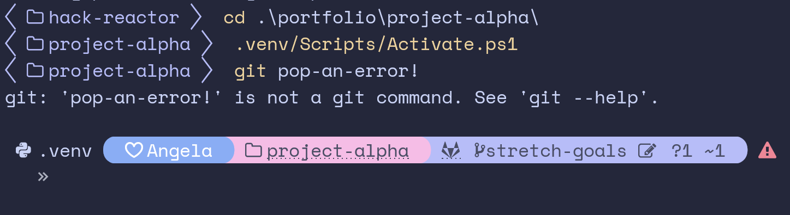

# Angela's Catppuccin for Oh My Posh


## About

This is my personalized version of the Catppuccin aesthetic for [Oh My Posh](https://github.com/JanDeDobbeleer/oh-my-posh) (OMP), tailored specifically for Windows Powershell. Using the look and palette from the official [Catppuccin theme](https://ohmyposh.dev/docs/themes#catppuccin), I customized the segments to be more succinct while also providing more detail. I am still new to json files and Oh My Posh, so I will be iterating over the design as I continue to learn. The aesthetic should remain the same, however!



---

## Highlights

- Python virtual environment support (read my installation instructions for how to remove the original (.venv) from Powershell)
- Linked path locations for full directory locations and git repos.
- Git tracking icons to visualize pending file changes and more
- Docker support (disclaimer: currently untested, but shouldn't have issues outside of a wonky color palette if anything)
- Status code visualization to help errors go unmissed
- Transient prompts to help keep track of command history

---

## Installation

Install [Oh My Posh](https://github.com/JanDeDobbeleer/oh-my-posh) via [its instructions](https://ohmyposh.dev/docs/installation/windows).

Ensure you install a [Nerd Font](https://www.nerdfonts.com/). OMP makes this simple, so follow its instructions [here](https://ohmyposh.dev/docs/installation/fonts) if you haven't done so already.

Edit your powershell profile (`code $PROFILE`) to add the following:
```
oh-my-posh init pwsh --config 'https://gitlab.com/angelajfisher/angelas-catppuccin-for-omp/-/raw/main/angelas-catppuccin.omp.json' | Invoke-Expression

$env:VIRTUAL_ENV_DISABLE_PROMPT = 1
```

Alternatively, you can download the json file and point the config to your local copy. Be sure to include the virtual environment disabling line to avoid redundant (.venv) visualizations in your prompt.

Restart powershell and then you should be go to go! Enjoy!

---

### Matching My look

If you install the theme and decide you want to dive even further into the Catppuccin aesthetic, consider setting up [their Windows Terminal themes](https://github.com/catppuccin/windows-terminal)! The one I'm using in my screenshot is Catppuccin Macchiato. This way, your background and all of the colored text will match this OMP theme, too :)

---

### Making Your Own Tweaks

I know not everyone wants a heart next to their username and others may like the segments but not the color palette. Here's some quick instructions to anyone unfamiliar with OMP themes and/or json files. Of course, you will need your own copy of the json file in order to make these changes.

To remove the heart next to the username, change line 28 to: `"template": " {{ if .SSHSession }}\ueba9 {{ end }}\u2665 {{ .UserName }} "`

To make easy changes the color palette, change the hex values in the palette section at the bottom of the file to those of your colors of choice. If you feel more comfortable with tinkering, change the color names and their use cases!
